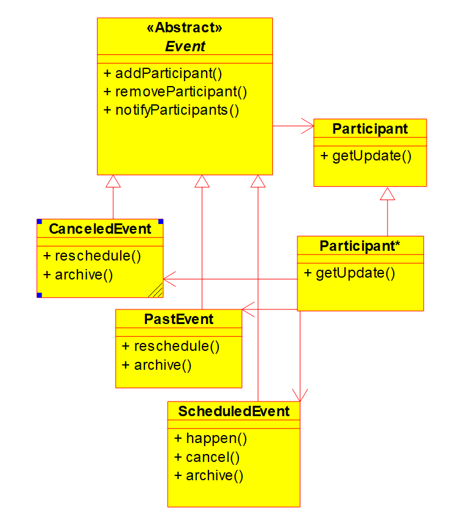

# SENG301 Assignment 1 (2021) - Student answers

**Xiaojie Wang, Student ID: 18928477**

## Task 1.b - Write acceptance tests for U3 - Add participants to events

### Feature file (Cucumber Scenarios)

**participant.feature**

### Java class implementing the acceptance tests

**AddParticipantFeature.java**

## Task 2 - Identify the patterns in the code

### Pattern 1

#### What pattern is it?

**State pattern**

#### What is its goal in the code?

**Allows an event to alter its behavior when its state changes**

#### Name of UML Class diagram attached:

**StatePatternUML.png**

#### Mapping to GoF pattern elements:

| GoF element | Code element |
| ----------- | ------------ |
| Context  | EventHandlerImpl |
| Request() | updateEventStatus() |
| State | Event |
| ConcreteStateA | ArchivedEvent |
| ConcreteStateB | CanceledEvent |
| ConcreteStateC | PastEvent |
| ConcreteStateD | ScheduledEvent |
| handle() | cancel() |
| handle() | happen() |
| handle() | reschedule() |
| handle() | archive() |

### Pattern 2

#### What pattern is it?

**Abstract Factory pattern**

#### What is its goal in the code?

**Provides an interface for creating families of related or dependent objects without specifying their concrete classes**

#### Name of UML Class diagram attached:

**AbstractFactoryPatternUML.png**

#### Mapping to GoF pattern elements:

| GoF element | Code element |
| ----------- | ------------ |
| AbstractFactory |  EventHandler |
| ConcreteFactory | EventHandlerImpl |
| CreateProduct() | createEvent() |
| AbstractProduct | Event |
| ConcreteProduct | Event* |

## Task 3 - Full UML Class diagram

### Name of file of full UML Class diagram attached

**RetroDocumentUML.png**

## Task 4 - Implement new feature

### What pattern fulfils the need for the feature?

**Observer pattern**

### What is its goal and why is it needed here?

**Defines a one-to-many dependency between events and participants so that when one event changes state all its participants are notified and updated automatically**

### Name of UML Class diagram attached:

**ObserverPatternUML.png**

### Mapping to GoF pattern elements:

| GoF element | Code element |
| ----------- | ------------ |
|  Subject   |   Event  |
| ConcreteSubject | CanceledEvent |
| ConcreteSubject | PastEvent |
| ConcreteSubject | ScheduledEvent | 
| Observer | Participant | 
| ConcreteObserver | Participant* |
| Notify() | notifyParticipants() |
| Attach(observer) | addParticipant() |
| Detach(observer) | removeParticipant() |
| Update() | getUpdate() |
| doSomething() | happen() |
| doSomething() | cancel() |
| doSomething() | reschedule() |
| doSomething() | archive() |

## Task 5 - BONUS - Acceptance tests for Task 4

### Feature file (Cucumber Scenarios)

**status.feature**

### Java class implementing the acceptance tests

**UpdateStatusFeature.java**
